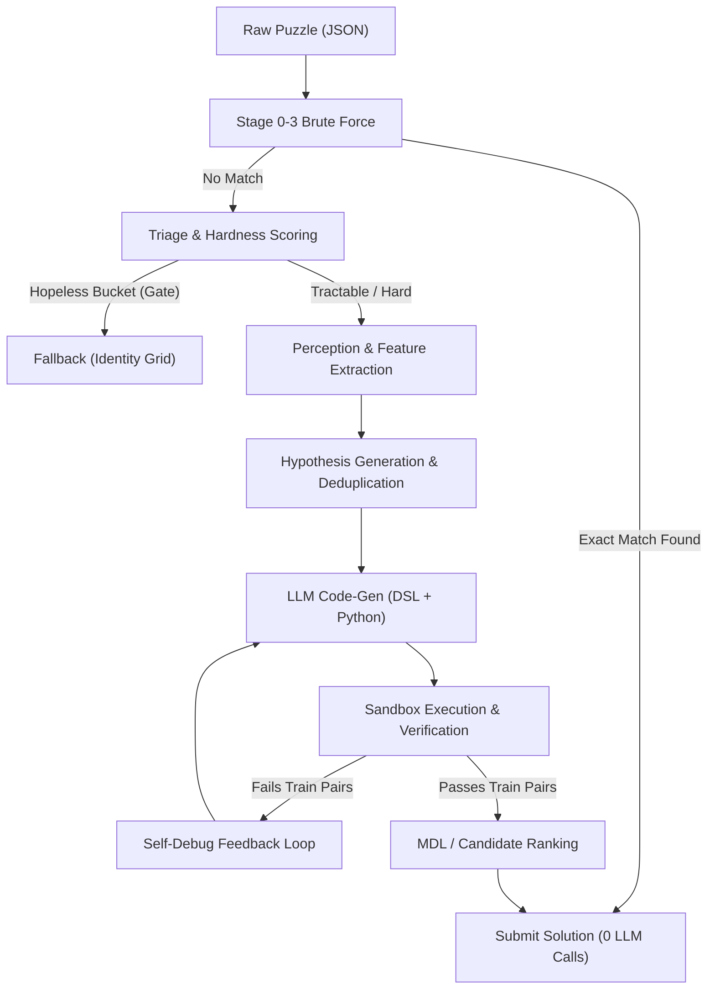

# 🧩 ARC-AGI-2 Puzzle Solver

An end-to-end, graduated-effort autonomous solver for the **ARC-AGI-2 (Abstraction and Reasoning Corpus)** challenge. Built for high-efficiency competitive execution under strict resource constraints (e.g. Kaggle 9-hour offline GPU limit).

---

## 🌟 Key Features

* **Graduated Effort Ladder**: Fast deterministic rules (0ms–200ms) resolve simple puzzles instantly before escalating to LLMs.
* **4-Stage Brute-Force Rule Synthesizer**: Tests single unaries, cross-primitive compositions (`recolor + crop`, `gravity + geometric`), parameter sweeps, and symmetry stacks. Solves **27 / 1000** training puzzles in ~181ms with **0% false positives**.
* **Pre-LLM Triage & Hopeless Hard-Gate**: Evaluates structural hardness (0.0 to 1.0) without an LLM to immediately gate out unsolvable puzzles, saving budget for solvable tasks.
* **Safe Isolated Sandbox Pool**: Persistent multiprocessing worker pool with AST safety checks, zero process-spawn overhead, and graduated timeout tiers (5s $\to$ 8s $\to$ 10s).
* **Multi-Turn Visual Self-Debug**: Automatic diff extraction comparing actual vs expected outputs, feeding errors back to the model with targeted debugging guidance.
* **Minimum Description Length (MDL) Selection**: Chooses simpler, more generalized code when multiple candidate programs pass all demonstration pairs.
* **Swappable LLM Backends**:
  * `kaggle_local`: In-process 4-bit NF4 quantized HuggingFace models (e.g. `Qwen/Qwen3-8B`) for offline GPU scoring.
  * `ollama`: Local Ollama server (`qwen2.5:7b`) for offline development on laptop/CPU.
  * `api`: Cloud API mode (`gemini-flash-lite-latest`) for fast benchmarking.

---

## 🏗️ Architecture & Pipeline Flow



---

## 📁 Repository Structure

```text
arc-solver/
├── src/
│   ├── brute_force.py      # Instant 4-stage deterministic solver (Stages 0-3)
│   ├── constraints.py      # Extracts size/color/object constancy invariants
│   ├── early_stop.py        # Early termination when perfect verification is reached
│   ├── hypothesis_dedup.py # Semantic deduplication of natural language ideas
│   ├── hypothesis_filter.py# Rejects geometrically implausible hypotheses
│   ├── judge.py            # Holistic program ranking & candidate selection
│   ├── library.py          # Domain-specific primitives (rotations, flood fill, etc.)
│   ├── llm_client.py       # Unified LLM client (Kaggle HF / Ollama / Gemini / Mock)
│   ├── loader.py           # Loads ARC puzzle JSONs into structured dataclasses
│   ├── pipeline.py         # Main orchestrator linking all stages
│   ├── preprocess.py       # Object segmentation & connected components
│   ├── routing.py          # Escalation logic between local and fallback backends
│   ├── sandbox.py          # Safe worker pool with graduated timeout tiers (5s/8s/10s)
│   ├── self_debug.py       # Visual diff feedback loop for error correction
│   ├── submission.py       # Formats test output predictions
│   ├── tiebreak.py         # MDL code complexity scoring
│   ├── triage.py           # Pre-LLM structural hardness scoring (0.0 to 1.0)
│   └── prompts/            # System & user prompt templates
│
├── notebooks/
│   ├── kaggle_dry_run.ipynb    # 20-puzzle GPU benchmark & budget measurement
│   └── kaggle_submission.ipynb # Official 1000-puzzle Kaggle submission notebook
│
├── scripts/
│   ├── eval_brute_force.py # Benchmarks brute-force engine across 1000 puzzles
│   ├── build_submission.py # Bundles outputs into competition submission.json
│   ├── diag_25.py          # 25-puzzle diagnostic suite across easy/medium/hard
│   └── run_e2e.py          # End-to-end solver for individual puzzles
│
├── tests/
│   ├── test_easy_puzzles.py          # Core unit test suite (10/10 passing)
│   └── test_brute_force_refactored.py# Brute-force execution tests
│
├── config.yaml             # Local development settings (Ollama / CPU)
├── config.gemini.yaml      # Cloud API benchmark settings
├── config.kaggle.yaml      # Kaggle offline GPU settings (Qwen3-8B 4-bit NF4)
└── requirements.txt        # Python package dependencies
```

---

## 🚀 Getting Started

### 1. Installation

```bash
# Clone the repository
git clone https://github.com/venki-byte/arc-solver.git
cd arc-solver

# Install dependencies
pip install -r requirements.txt
```

*(Optional for GPU acceleration)*:
```bash
pip install torch --index-url https://download.pytorch.org/whl/cu124
pip install -r requirements.txt
```

---

### 2. Running Unit Tests

Run the test suite to verify pipeline components:

```bash
pytest tests/test_easy_puzzles.py -v
```

---

### 3. Evaluating the Brute-Force Engine

Benchmark the fast deterministic solver on the 1000 ARC training puzzles:

```bash
python scripts/eval_brute_force.py --data-dir data/arc-agi-2/training
```

Output:
```text
========================================
BRUTE-FORCE EVALUATION SUMMARY
========================================
Total Puzzles Checked:         1000
Solved by Brute-force:         27
False Positives:               0
Average Brute-force Time (ms): 181.41
Solves by Stage:
  Stage 0 (Unaries):            8
  Stage 1 (Cross-Primitives):   9
  Stage 2 (Parameter Sweeps):   2
  Stage 3 (Tiling/Symmetries):  8
========================================
```

---

### 4. Running a Single Puzzle End-to-End

```bash
# Using Mock backend (fast verification)
python -m scripts.run_e2e --backend mock --puzzle 6150a2bd

# Using Ollama local model
python -m scripts.run_e2e --backend ollama --model qwen2.5:7b --puzzle 6150a2bd
```

---

## 🏆 Kaggle Competition Deployment

1. **Dry-Run Benchmark**: Run [`notebooks/kaggle_dry_run.ipynb`](notebooks/kaggle_dry_run.ipynb) on a **GPU P100** instance to measure real Qwen3-8B inference speed and verify the 8.5-hour budget.
2. **Full Submission**: Run [`notebooks/kaggle_submission.ipynb`](notebooks/kaggle_submission.ipynb) with internet turned **OFF** to generate the final `submission.json`.
3. See [`docs/KAGGLE_SETUP.md`](docs/KAGGLE_SETUP.md) for full setup instructions.

---

## 📄 License

MIT License. Developed for ARC-AGI-2 reasoning research and competition benchmarking.
